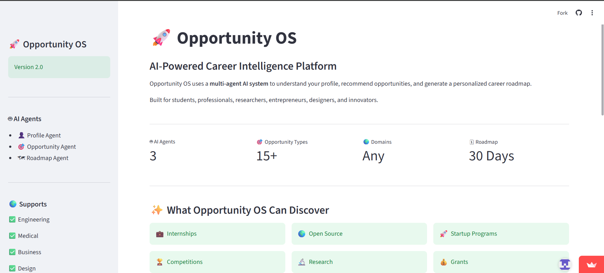

# 🚀 Opportunity OS

> **An AI-Powered Multi-Agent Career Intelligence Platform**

Opportunity OS is a multi-agent AI platform that analyzes a user's profile, discovers relevant career opportunities, and generates a personalized roadmap using intelligent AI agents, MCP (Model Context Protocol), and Groq LLMs.

🌐 **Live Demo:** https://opportunity-os-zxy4sjfnknkycove7k4eaz.streamlit.app/

---

## 📸 Application Preview



---

---

## ✨ Features

- 🤖 Multi-Agent AI Architecture
- 🔌 MCP (Model Context Protocol) Integration
- 🎯 Personalized Career Analysis
- 💼 Internship Discovery
- 🏆 Competition Recommendations
- 🌍 Open Source Opportunities
- 🚀 Startup Programs
- 📚 Research Opportunities
- 🛡 Prompt Injection Protection
- 🗺 AI-Generated Career Roadmap
- ☁️ Fully Deployed on Streamlit Cloud

---

## 🏗 System Architecture

```
                    User
                      │
                      ▼
                Streamlit UI
                      │
                      ▼
            Opportunity OS Orchestrator
                      │
      ┌───────────────┼───────────────┐
      ▼               ▼               ▼
 Profile Agent   Opportunity Agent   Roadmap Agent
                      │
                      ▼
                 MCP Client
                      │
                      ▼
                 MCP Server
                      │
      ┌───────────────┼───────────────┐
      ▼               ▼               ▼
 Internships   Hackathons   Open Source
                      │
                      ▼
                  Groq LLM
                      │
                      ▼
             Personalized Response
```

---

# 🤖 AI Agents

## 👤 Profile Agent

Analyzes:

- Education
- Skills
- Experience
- Interests
- Career Goals

Produces a structured career profile.

---

## 🎯 Opportunity Agent

Uses MCP tools to discover:

- Internships
- Hackathons
- Competitions
- Open Source Programs

Ranks opportunities according to the user's profile.

---

## 🗺 Roadmap Agent

Generates a personalized roadmap including:

- Learning Plan
- Recommended Skills
- Certifications
- Projects
- Timeline

---

## 🔌 MCP Integration

Opportunity OS uses the **Model Context Protocol (MCP)** to separate the AI model from external tools.

Available MCP Tools:

- search_internships()
- search_hackathons()
- search_open_source()
- search_competitions()

The Opportunity Agent automatically invokes these tools whenever additional information is required.

---

## 🛡 Security Features

Opportunity OS includes basic prompt security mechanisms:

- Prompt Injection Detection
- Input Validation
- Profile Length Validation
- Secure API Keys using Streamlit Secrets
- Environment Variable Protection

---

# 🛠 Tech Stack

## Frontend

- Streamlit

## Backend

- Python

## AI

- Groq
- GPT-OSS-120B

## Agent Framework

- Custom Multi-Agent Architecture

## Protocol

- Model Context Protocol (MCP)

## Deployment

- Streamlit Community Cloud

---

## 📂 Project Structure

```
opportunity-os/
│
├── agents/
│   ├── profile_agent.py
│   ├── opportunity_agent.py
│   └── roadmap_agent.py
│
├── mcp_server/
│   ├── client.py
│   ├── server.py
│   └── tools.py
│
├── skills/
│
├── utils/
│
├── app.py
├── orchestrator.py
├── requirements.txt
└── README.md
```

---

## 🚀 Running Locally

Clone the repository

```bash
git clone https://github.com/gouravdalwale/opportunity-os.git
```

Install dependencies

```bash
pip install -r requirements.txt
```

Create a `.env` file

```env
PROFILE_API_KEY=your_key
OPPORTUNITY_API_KEY=your_key
ROADMAP_API_KEY=your_key
```

Run the application

```bash
streamlit run app.py
```

---

## ☁ Deployment

The application is deployed using **Streamlit Community Cloud**.

The deployed version securely stores API keys using Streamlit Secrets.

---

## 🎯 Future Improvements

- Live Opportunity APIs
- Resume Analysis
- LinkedIn Integration
- Email Notifications
- Company Matching
- RAG-based Knowledge Base
- Vector Database Support

---

## 👨‍💻 Author

**Gourav Dalwale**

GitHub:
https://github.com/gouravdalwale

---

## ⭐ If you like this project

Please consider giving it a ⭐ on GitHub.